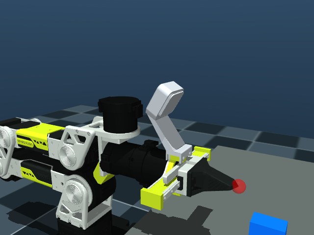
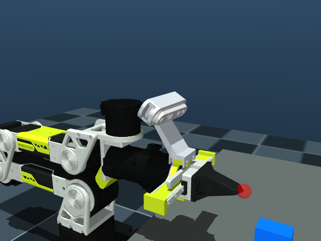
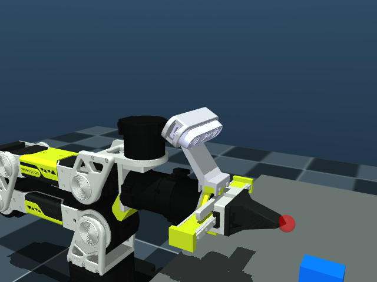

# B601-RS / B601-DM 通用腕部相机描述 / Shared Wrist Camera Assemblies

本目录提供 B601-RS 与 B601-DM 通用的 RealSense D405、RealSense D435i 和 Orbbec Gemini 2 三套相机装配资源。两款机械臂共用相机本体、支架及网格，可复用同一套相机装配 URDF；接入各自机械臂时需对齐腕部安装参考系。资源包含安装位置、安装螺钉参考系及光学坐标系，与 `ReBot_Arm_DigitalTwin_RS` 中已验证的版本一致。

This directory provides RealSense D405, RealSense D435i and Orbbec Gemini 2 camera assemblies shared by B601-RS and B601-DM. Both arms share the camera bodies, brackets and meshes and can reuse the same camera assembly URDFs after aligning their wrist mounting reference frames. The assets include mounting poses, screw reference frames and optical frames and match the tested version in `ReBot_Arm_DigitalTwin_RS`.

## MuJoCo 装配预览 / MuJoCo Assembly Previews

以下三张 MuJoCo 仿真截图以 B601-RS 为展示平台，展示 RS、DM 共用的三款相机及支架装配。

These three MuJoCo simulation screenshots use B601-RS to illustrate the camera and bracket assemblies shared by RS and DM.

### RealSense D405



D405 相机及 D405 / 305 支架。装配描述：[`urdf/d405.urdf`](urdf/d405.urdf)。

D405 camera with the D405 / 305 bracket. Assembly description: [`urdf/d405.urdf`](urdf/d405.urdf).

### RealSense D435i



D435i 相机及 D435 / Gemini 2 支架。装配描述：[`urdf/d435i.urdf`](urdf/d435i.urdf)。

D435i camera with the D435 / Gemini 2 bracket. Assembly description: [`urdf/d435i.urdf`](urdf/d435i.urdf).

### Orbbec Gemini 2



Gemini 2 相机及 D435 / Gemini 2 支架。装配描述：[`urdf/gemini2.urdf`](urdf/gemini2.urdf)。

Gemini 2 camera with the D435 / Gemini 2 bracket. Assembly description: [`urdf/gemini2.urdf`](urdf/gemini2.urdf).

## 目录结构 / Directory Structure

```text
Camera/
├── README.md
├── images/                    # MuJoCo 装配截图 / assembly screenshots
│   ├── d405-mujoco.png
│   ├── d435i-mujoco.png
│   └── gemini2-mujoco.png
├── urdf/
│   ├── d405.urdf
│   ├── d435i.urdf
│   └── gemini2.urdf
├── meshes/
│   ├── mounts/                # 安装支架 / mounting brackets
│   ├── realsense/             # D405 STL 和 D435 Collada / camera meshes
│   └── gemini2/               # Gemini 2 STL
├── source/                    # 上游 Xacro / upstream Xacro files
├── source.json                # 来源版本和哈希 / source revisions and hashes
├── licenses/
└── scripts/
    └── build-wrist-camera-urdfs.py
```

## 使用方式 / Usage

三个 URDF 都以空的 `gripper_end` link 为根，保留相机装配的腕部安装参考系。机械臂本体分别见 [RS URDF](../RS/urdf/ReBot_Arm_RS.urdf) 和 [DM URDF](../DM/urdf/ReBot_Arm_DM.urdf)。RS 可挂到现有的 `gripper_end` link；本仓库 DM 描述的末端 link 名为 `end_link`，接入时需建立对应的固定安装变换，将相机根参考系对齐到实际安装位置。

All three URDFs use an empty `gripper_end` link as the camera assembly root and wrist mounting reference. Arm descriptions are available in the [RS URDF](../RS/urdf/ReBot_Arm_RS.urdf) and [DM URDF](../DM/urdf/ReBot_Arm_DM.urdf). RS can attach the camera to its existing `gripper_end` link. The DM description in this repository uses `end_link`; integrate it with a fixed mounting transform that aligns the camera root reference frame with the physical mounting location.

合并到 RS URDF 时，删除相机描述中作为占位的空 `gripper_end` link，再合入其余 link、joint 和 material，避免重复定义。合并到 DM URDF 时，可保留相机根参考 link，并用固定 joint 连接到 `end_link`，在该 joint 中设置安装参考系变换。合并到其他目录时，需要同步调整网格路径。

When merging into the RS URDF, remove the empty placeholder `gripper_end` link from the camera description, then merge the remaining links, joints and materials without duplicate definitions. For the DM URDF, retain the camera root reference link and connect it to `end_link` with a fixed joint specifying the mounting reference transform. Update mesh paths if the merged file is stored in another directory.

网格路径相对于 `urdf/` 目录，复制时请保留整个 `Camera/` 目录。ROS / RViz 使用时，可将路径转换为所在 ROS package 的 `package://` URI，并安装所有资源。D435i 使用 D435 的 Collada（`.dae`）外壳，加载器需要支持该格式。

Mesh paths are relative to the `urdf/` directory, so copy the entire `Camera/` directory. For ROS / RViz, convert paths to `package://` URIs for the destination ROS package and install all assets. D435i uses the D435 Collada (`.dae`) body mesh, which requires Collada support in the loader.

加载已生成的 URDF 不需要厂家描述包、Xacro 或联网。三套描述共用部分 link 名称，使用时选择其中一套。

Loading the generated URDFs requires no vendor description packages, Xacro or network access. Select one assembly at a time because the descriptions share some link names.

## 安装参数 / Mounting Parameters

下表保留上游装配 Xacro 的值。XYZ 单位为米，RPY 单位为弧度。支架坐标相对于相机装配的 `gripper_end` 根参考系，相机坐标相对于支架 link；D405、D435i 的相机位置指底部安装螺钉参考系，Gemini 2 的相机位置指 `camera_link`。

The values below are preserved from the upstream assembly Xacros. XYZ is in metres and RPY is in radians. Bracket poses are relative to the camera assembly’s `gripper_end` root reference frame; camera poses are relative to the bracket link. D405 and D435i camera poses refer to their bottom mounting screw frames, while the Gemini 2 pose refers to `camera_link`.

| 型号 / Model | 支架 / Bracket XYZ | 支架 / Bracket RPY | 相机 / Camera XYZ | 相机 / Camera RPY |
| --- | --- | --- | --- | --- |
| D405 | -0.1201 0.0003 0.0507 | 1.5827 0.0024 1.5515 | -0.0003 0.0443 -0.0093 | -0.0225 -1.0448 -1.5460 |
| D435i | -0.1201 0.0003 0.0450 | 1.5827 0.0024 1.5515 | -0.0003 0.0445 -0.0095 | 0.0126 -1.0489 -1.5981 |
| Gemini 2 | -0.1201 0.0003 0.0450 | 1.5827 0.0024 1.5515 | 0.0249 0.0487 0.0090 | 0.0042 -1.0502 -1.5718 |

## 来源与许可 / Sources and Licensing

| 资源 / Assets | 来源及版本 / Source and Revision | 许可 / License |
| --- | --- | --- |
| 装配 Xacro 和转换后的支架 STL / Assembly Xacros and converted bracket meshes | [`xiehuangbao888/rebot_visual_grasp`](https://github.com/xiehuangbao888/rebot_visual_grasp/tree/dd28d65598deec767cf95fa45521d69b38155833/description), `dd28d65598deec767cf95fa45521d69b38155833` | 包声明 / Package declares Apache-2.0 |
| 支架 CAD 来源 / Bracket CAD provenance | [`Yang-Ci/Camera-Mounts`](https://github.com/Yang-Ci/Camera-Mounts)，注明设计来自 / attributes the designs to Seeed-Projects/reBot-DevArm | CERN-OHL-W-2.0 |
| RealSense Xacro 和相机网格 / RealSense Xacros and camera meshes | [`realsenseai/realsense-ros`](https://github.com/realsenseai/realsense-ros/tree/9215f26e8348ad5922a608b77882a9bfe05940f0/realsense2_description), `9215f26e8348ad5922a608b77882a9bfe05940f0` | Apache-2.0 |
| Gemini 2 Xacro 和网格 / Gemini 2 Xacro and meshes | [`orbbec/OrbbecSDK_ROS2`](https://github.com/orbbec/OrbbecSDK_ROS2/tree/c153462518ad674650bafa4464fda72c27ab797a/orbbec_description), `c153462518ad674650bafa4464fda72c27ab797a` | Apache-2.0 |

本次资源从 [`ReBot_Arm_DigitalTwin_RS`](https://github.com/Yang-Ci/ReBot_Arm_DigitalTwin_RS/tree/8e153cb248e30ae2f82275f26ec3f94768852784/reBotArm_simulator-RS/public/models/wrist-cameras) 的提交 `8e153cb248e30ae2f82275f26ec3f94768852784` 同步。支架 STL 是 `rebot_visual_grasp` 提供的转换版本。许可文本位于 `licenses/`；`source.json` 记录原始路径、版本、字节数和 SHA-256。`source/` 和 `meshes/` 保留上游原始文件内容。

The assets were imported from [`ReBot_Arm_DigitalTwin_RS`](https://github.com/Yang-Ci/ReBot_Arm_DigitalTwin_RS/tree/8e153cb248e30ae2f82275f26ec3f94768852784/reBotArm_simulator-RS/public/models/wrist-cameras) at commit `8e153cb248e30ae2f82275f26ec3f94768852784`. The bracket STLs are the converted versions supplied by `rebot_visual_grasp`. License texts are in `licenses/`; `source.json` records original paths, revisions, byte sizes and SHA-256 hashes. Files in `source/` and `meshes/` retain their original upstream contents.

## 重新生成 URDF / Regenerate URDFs

重新生成时需要 Python `xacro` 模块。在 `Rebot_Arm_description/` 目录执行：

Regeneration requires the Python `xacro` module. Run from the `Rebot_Arm_description/` directory:

```bash
python3 Camera/scripts/build-wrist-camera-urdfs.py
```

脚本只使用本目录附带的源文件，将上游机械臂 include 替换为空的安装参考 link，展开相机宏，并把网格 package URI 转换为相对路径。

The script uses only the bundled source files. It replaces the upstream arm include with an empty mounting reference link, expands camera macros and converts mesh package URIs to relative paths.
